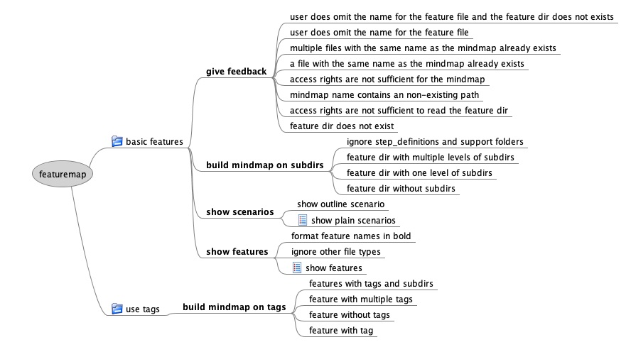

# featuremap

This script converts Gherkin feature files into a [Freemind mindmap](http://freemind.sourceforge.net/wiki/index.php/Main_Page).

## Installation

Run `gem install featuremap` to install **featuremap** and all required libraries.

### Prerequisites

Featuremap is a Ruby script. It uses the [cuke_modeler](https://github.com/enkessler/cuke_modeler) gem to analyze Gherkin feature files.

## Usage
featuremap [options] features_dir [mindmap_file]

|parameter|description|
|---------|-----------|
|features_dir|This is the root directory containing the Gherkin feature files. Typically named "features".|
|mindmap_file|The name of the mindmap file created by featuremap. If omitted **featuremap** writes to stdout.|

### Options

|parameter|description|
|---------|-----------|
|-v, --verbose| show log messages (disabled by default if **featuremap** writes to stdout)|
|-t, --use_tags| use tags instead of subdirs to attach feauture names to the mindmap|
